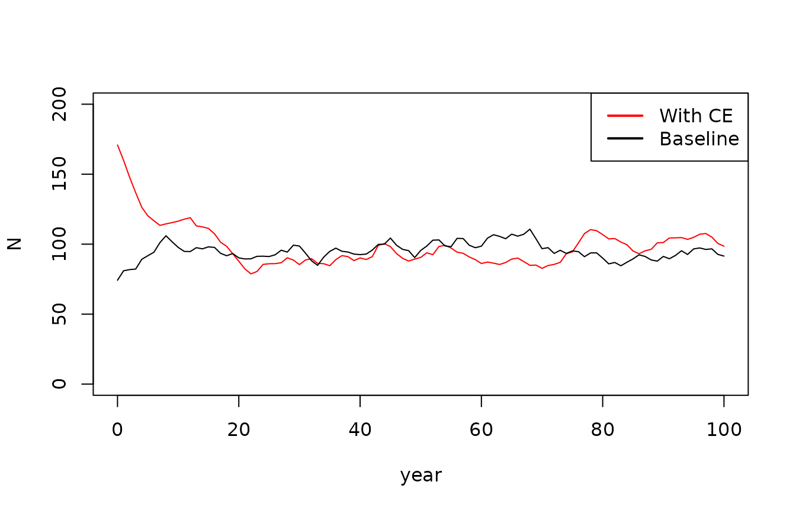
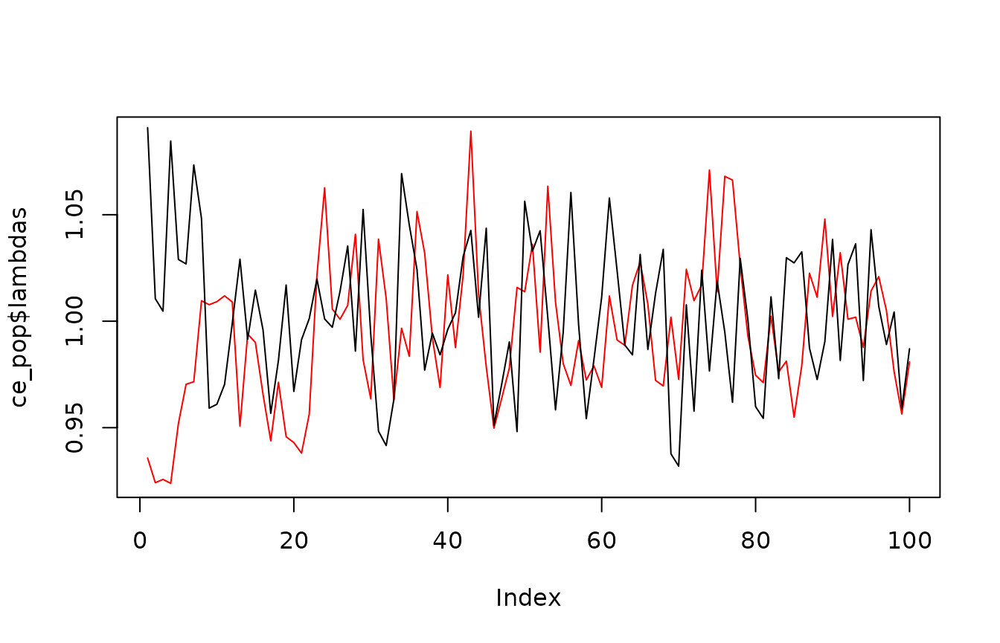

# 3. Population Model Overview

## Overview

This tutorial covers the population model component of the `CEMPRA`
r-package. The population model is included as an extension to the
original Joe Model and leverages a flexible stage-structured population
modelling framework that can be modified for different target systems.
The underlying population model code was originally developed by van der
Lee and Koops (2020)[¹](#fn1) and then further modified by [Dr. Kyle
Wilson](https://github.com/klwilson23) to incorporate environmental
stressors that are linked to survivorship, capacity and growth.

## Input parameters

The inputs for the population model include key parameters defined in
the `life_cycles.csv` input file. Users can adjust and modify these
values to represent a species of interest or run the model with the
default values (currently representing the life history traits for
Westslope Cuttroat Trout). These parameters can be modified such that
the population model represents a target species of interest. The
example below shows life history parameters that will be used to build
the stage-structured population matrix model. For a detailed description
of the underlying mechanisms of the population model refer the the
[CEMPRA User Guide](https://github.com/klwilson23)

van der Lee and Koops (2020).

``` r
# Install the CEMPRA (first-time users)
# library(devtools)
# devtools::install_github("essatech/CEMPRA")

# Load the CEMPRA package.
library(CEMPRA)

filename_lc <- system.file("extdata", "life_cycles.csv", package = "CEMPRA")
life_cycles <- read.csv(filename_lc)
print(life_cycles)
#>                                              Parameters    Name  Value
#> 1                                 Number of life stages  Nstage    4.0
#> 2                                        Adult capacity       k  100.0
#> 3                               Spawn events per female  events    1.0
#> 4                                 Eggs per female spawn     eps 3000.0
#> 5                                     spawning interval     int    1.0
#> 6                                          egg survival      SE    0.1
#> 7                                          yoy survival      S0    0.3
#> 8                                             sex ratio      SR    0.5
#> 9                                    Hatchling Survival  surv_1    0.3
#> 10                                    Juvenile Survival  surv_2    0.3
#> 11                                   Sub-adult Survival  surv_3    0.9
#> 12                                       Adult Survival  surv_4    0.9
#> 13                                   Years as hatchling  year_1    1.0
#> 14                                    years as juvenile  year_2    2.0
#> 15                                    years as subadult  year_3    2.0
#> 16                                       years as adult  year_4    5.0
#> 17                      egg survival compensation ratio    cr_E    1.0
#> 18                      yoy survival compensation ratio    cr_0    3.0
#> 19                hatchling survival compensation ratio    cr_1    2.5
#> 20                 juvenile survival compensation ratio    cr_2    2.0
#> 21                 subadult survival compensation ratio    cr_3    1.1
#> 22                    adult survival compensation ratio    cr_4    1.0
#> 23                                maturity as hatchling   mat_1    0.0
#> 24                                 maturity as juvenile   mat_2    0.0
#> 25                                 maturity as subadult   mat_3    0.0
#> 26                                    maturity as adult   mat_4    1.0
#> 27                          variance in eggs per female  eps_sd 1000.0
#> 28            correlation in egg fecundity through time egg_rho    0.1
#> 29 coefficient of variation in stage-specific mortality    M.cv    0.1
#> 30                correlation in mortality through time   M.rho    0.1
```

## Setup the matrix

[`pop_model_setup()`](https://essatech.github.io/CEMPRA/reference/pop_model_setup.md)
and
[`pop_model_matrix_elements()`](https://essatech.github.io/CEMPRA/reference/pop_model_matrix_elements.md)
are run first to build the elements needed to run the full population
matrix model. You can explore the data objects generated from these
functions which include some density-independent components of a matrix
model. Below we can see the transition matrix.

``` r

# Setup objects for population model
pop_mod_setup <- pop_model_setup(life_cycles = life_cycles)

# Build matrix elements for population model
pop_mod_mat <- pop_model_matrix_elements(pop_mod_setup = pop_mod_setup)
#> Running with S0 adjusted to s0.1.det...
names(pop_mod_mat)
#> [1] "projection_matrix"      "life_histories"         "life_stages_symbolic"  
#> [4] "density_stage_symbolic" "anadrmous"
print(pop_mod_mat$projection_matrix)
#>      [,1]       [,2]      [,3]       [,4]
#> [1,]  0.0 0.00000000 0.0000000 45.0000000
#> [2,]  0.3 0.23076923 0.0000000  0.0000000
#> [3,]  0.0 0.06923077 0.4736842  0.0000000
#> [4,]  0.0 0.00000000 0.4263158  0.7558057
```

## Calculate simple matrix elements from the popbio package

Running the next block of code is optional, but it is included for
demonstration purposes to highlight how we can use functions from the
external `popbio` R package to generate simple matrix elements from an
eigne analysis (e.g., lambda values, sensitivities and elasticities
etc). Note that these elements consider density-independent growth. In
the next section we project the population forward while accounting for
density-dependent growth.

``` r
# Preview density-independent transition projection_matrix
  A <- pop_mod_mat$projection_matrix
# Assign nicknames for each stage
  # snames <- c("egg_yoy", "juv", "subadult", "adult")
  # rownames(A) <- colnames(A) <- snames
# Simple density-independent lambda estimate
  popbio::lambda(A)
#> [1] 1.211018
# Simple Eigen analysis
  popbio::eigen.analysis(A)$elasticities
#>           [,1]      [,2]       [,3]      [,4]
#> [1,] 0.0000000 0.0000000 0.00000000 0.1529476
#> [2,] 0.1529476 0.0360068 0.00000000 0.0000000
#> [3,] 0.0000000 0.1529476 0.09825795 0.0000000
#> [4,] 0.0000000 0.0000000 0.15294763 0.2539447
```

## Density-dependent time series population projections

Project the population forward through time with density-dependent
constraints applied. Density-dependence acts on all life stages and is
structured as a Beverton-Holt relationship. Compensatory
density-dependence is applied and back-calculated solving an equation
that sets the global lambda value to 1. The projection runs with
stochasticity and naturally hovers around the Adult capacity (K) value.
See van der Lee and Koops (2020) for additional details. Note that at
this point we are not considering any stressors as the cumulative effect
dataframe (`CE_df`) is set to NULL.

``` r
# Set the K.adj (K adjustment prior to pop model run)
life_histories <- pop_mod_mat$life_histories
# Mathematical expression of the transition matrix
life_stages_symbolic <- pop_mod_mat$life_stages_symbolic
# Mathematical expression of the density matrix
density_stage_symbolic <- pop_mod_mat$density_stage_symbolic

# Run simple population projection - project forward through time
baseline <-
  Projection_DD(
    M.mx = life_stages_symbolic,
    # projection matrix expression
    D.mx = density_stage_symbolic,
    # density-dependence matrix
    H.mx = NULL,
    dat = life_histories,
    # life history data
    K = life_histories$Ka,
    # initial pop size as stage-structure vector
    Nyears = 100,
    # years to run simulation
    p.cat = 0,      # Probability of catastrophe
    CE_df = NULL
  )

names(baseline)
#> [1] "pop"     "N"       "lambdas" "vars"    "Cat."

# Time series of the population
plot(baseline$pop, type = 'l')
```


``` r

# Time series of lambda values
plot(baseline$lambdas, type = 'l', ylab = "lambda", xlab = "year")
```


## Population Projections with CE Stressors

Then re-run the population model projections, but this time add on
environmental stressors. Note that in this simple example two imaginary
stressors are added `CE_df1` and `CE_df2` with fake data. These
stressors target fry capacity and juvenile survival, respectively. The
first stressor (`My Stressor1`) reduces the fry carrying capacity by 18%
(0.82) and the second stressor decreases the fry survival by 20% (0.80).

``` r

# Very simple CE data frame of one watershed 
# and two stressors (My Stressor1, My Stressor2)
CE_df1 <- data.frame(HUC = 123,
           Stressor = "My Stressor1",
           dose = 123,      # Stressor magnitude
           sys.cap = 0.82,  # Effect of vital rate (dose:response)
           life_stage = "fry_parr",
           parameter = "capacity",
           Stressor_cat = "My Stressor1")
# Second stressor - fake data
CE_df2 <- data.frame(HUC = 123,
                    Stressor = "My Stressor2",
                    dose = 123,
                    sys.cap = 0.80,
                    life_stage = "all_juv",
                    parameter = "survival",
                    Stressor_cat = "My Stressor2")
# Stressors dataframe
CE_df <- rbind(CE_df1, CE_df2)
```

Rerun the population model. Note the plots below the red line is the
baseline and the black line is the population projection run with
stressors included. In each example the population is suppressed when
the stressors are included.

``` r
ce_pop <- Projection_DD(M.mx = life_stages_symbolic,
                        D.mx = density_stage_symbolic,
                        H.mx = NULL,
                        dat = life_histories,
                        K = life_histories$Ka,
                        Nyears = 100,
                        p.cat = 0,
                        CE_df = CE_df
                        )


# Time series of the population with CE
plot(ce_pop$pop, type = 'l', ylim = c(0, 200), col = "red")
points(baseline$pop, type = 'l', col = "black")
legend("topright", legend = c("With CE", "Baseline"), col = c("red", "black"), lwd = 2)
```



``` r

# Time series of lambda values
plot(ce_pop$lambdas, type = 'l', col = "red")
points(baseline$lambdas, type = 'l', col = "black")
```



``` r

# Ratio Relative system capacity
baseline_sys_cap <- stats::median(baseline$pop$N[50:100])
ce_sys_cap <- stats::median(ce_pop$pop$N[50:100])
ce_sys_cap / baseline_sys_cap
#> [1] 0.9948103
```

------------------------------------------------------------------------

1.  van der Lee, A.S. and Koops, M.A. 2020. Recovery Potential Modelling
    of Westslope Cutthroat Trout (Oncorhynchus clarkii lewisi) in Canada
    (Saskatchewan-Nelson River populations). DFO Can. Sci. Advis. Sec.
    Res. Doc. 2020/046. v + 26 p.
