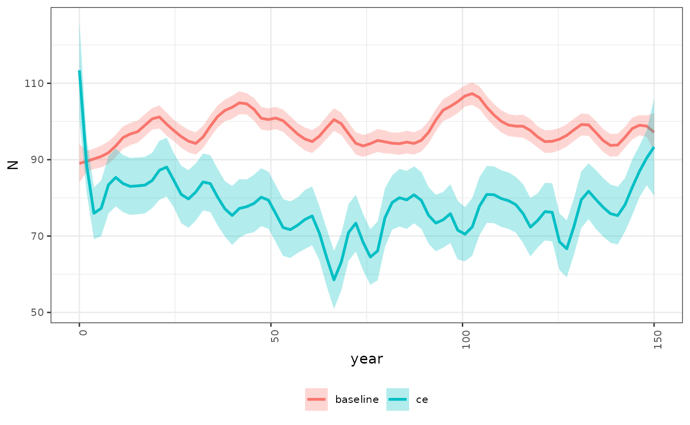
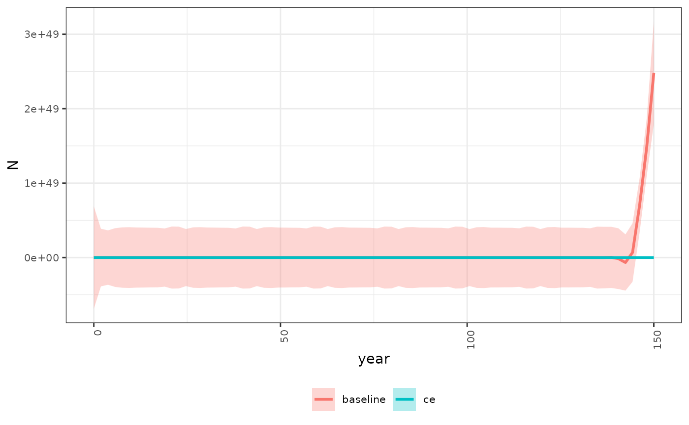

# 4. Population Model Batch Run

### Overview

Run the population model in batch mode. The population model in run
separately for each spatial unit and each scenario. This helper function
providers a wrapper to quickly explore alternative scenarios. Users may
change the population vital rates, environmental parameters (stressors)
or stressor-response curves between each batch model run.

### Load Input Data

In this example we will load the stressor-response, stressor magnitude
file and life cycles file. The polygon geometry is not needed to run the
population model. Reset `filename_` to point to a local file on your
computer.

``` r
    library(CEMPRA)

    # Load the stress-response workbook
    filename_sr <- system.file("extdata", "stressor_response_fixed_ARTR.xlsx", package = "CEMPRA")
    sr_wb_dat <- StressorResponseWorkbook(filename = filename_sr)

    # Load the stress-magnitude workbook
    filename_rm <- system.file("extdata", "stressor_magnitude_unc_ARTR.xlsx", package = "CEMPRA")
    dose <- StressorMagnitudeWorkbook(filename = filename_rm, scenario_worksheet = "natural_unc")

    # Load the life cycle parameters
    filename_lc <- system.file("extdata", "life_cycles.csv", package = "CEMPRA")
    life_cycle_params <- read.csv(filename_lc)
```

### Choose a Target Spatial Unit

The `PopulationModel_Run` run function runs the population model for
spatial units (e.g., watershed) individually. If users wish to run the
population model for all watersheds, they can simply wrap
`PopulationModel_Run` in a loop or apply function. Running watersheds
individually is advantageous because often certain parameters need to be
tweaked between the various watershed subunits.

``` r
# Choose target ID
# In this example just use the first watershed
HUC_ID <- dose$HUC_ID[1]
```

### Run the Population Model

Next, we can run the population model for a number of years `n_years`
and batch replicates `MC_sims`. `dose` is the stressor-magnitude data
object, `sr_wb_dat` is the stressor response workbook data object,
`life_cycle_params` is the life cycle parameters file for the target
species. `stressors` is an optional argument to specify whether the
model should be run with only a subset of the stressors (e.g.,
‘temperature’, ‘sediment’, if left as `NA` the model will run with all
stressors in the stressor magnitude file).

The output data object from `PopulationModel_Run` will consist of either
a list or dataframe object. If the `output_type` argument is set to
“full” then a list object will be returned containing the abundance time
series matrices for each batch replicate and each list stage with and
without stressor variables. However, the “full” output data object can
be cumbersome to work with. For convenience, the `output_type` argument
can be set to “adults” to return a simple dataframe object showing the
abundance of adults across years and batch replicates.

The model is always run with and without cumulative effect stressors -
since comparisons should always be made relative to a baseline or status
quo. The `group` variable in the output dataframe specifies whether the
model run includes stressor cumulative effect variables “ce” or baseline
reference conditions “baseline”.

``` r
    data <- PopulationModel_Run(
        dose = dose,
        sr_wb_dat = sr_wb_dat,
        life_cycle_params = life_cycle_params,
        HUC_ID = HUC_ID,
        n_years = 150,
        MC_sims = 5,
        stressors = NA,
        output_type = "adults"
    )
#> At least one NA in stressor values array
#> Running with S0 adjusted to s0.1.det...

    # Review output
    head(data, 3)
#>   year         N MC_sim group
#> 1    0 213.04017      1    ce
#> 2    1  27.98447      1    ce
#> 3    2  33.47777      1    ce

    # Look the median adult abundance
    
    # with stressor variables (cumulative effects)
    median(data$N[which(data$group == "ce")], na.rm = TRUE)
#> [1] 82.87616
    
    # and without stressor variables (baseline status quo)
    median(data$N[which(data$group == "baseline")], na.rm = TRUE)
#> [1] 97.83644
```

### Visualize the Time Series Projections

Simple plots can be included to visualize trends

``` r
library(ggplot2)

    ggplot(data, aes(x = year, y = N, color = group)) +
        stat_smooth(method="loess", span=0.1, se=TRUE, aes(fill = group), alpha=0.3) +
        theme_bw() +
        theme(
            legend.position = "bottom",
            legend.title = element_blank(),
            legend.text = element_text(size = 8),
            legend.key = element_blank(),
            axis.text.x = element_text(angle = 90, hjust = 1, size = 8),
            axis.text.y = element_text(size = 8),
            #axis.title.x = element_blank(),
            #axis.title.y = element_blank(),
            strip.text = element_text(size = 8))
#> `geom_smooth()` using formula = 'y ~ x'
```



## Location and life stage-specific BH capacities

Run an Example with BH carrying capacities

``` r
    
# Load the stress-response workbook
    filename_sr <- system.file("extdata", "./species_profiles/stressor_response_coho.xlsx", package = "CEMPRA")
    stressor_response <- StressorResponseWorkbook(filename = filename_sr)
    
    # Load the stress-magnitude workbook
    filename_rm <- system.file("extdata", "./species_profiles/stressor_magnitude_coho.xlsx", package = "CEMPRA")
    stressor_magnitude <- StressorMagnitudeWorkbook(filename = filename_rm)

    # Load the life cycle parameters
    filename_lc <- system.file("extdata", "./species_profiles/life_cycles_coho_nicola.csv", package = "CEMPRA")
    life_cycle_params <- read.csv(filename_lc)
    
    # Location and life stage-specific BH capacities
    filename_dd <- system.file("extdata", "./species_profiles/habitat_dd_k_coho.xlsx", package = "CEMPRA")
    habitat_dd_k <- readxl::read_excel(filename_dd)
```

Look at the location specific carrying capacity data

``` r
head(habitat_dd_k)
#> # A tibble: 1 × 11
#>   HUC_ID NAME  k_stage_0_mean k_stage_1_mean k_stage_2_mean k_stage_3_mean
#>    <dbl> <lgl> <lgl>                   <dbl> <lgl>                   <dbl>
#> 1      1 NA    NA                   10000000 NA                       1000
#> # ℹ 5 more variables: k_stage_0_cv <lgl>, k_stage_1_cv <dbl>,
#> #   k_stage_2_cv <lgl>, k_stage_3_cv <dbl>, notes <lgl>
```

Run the population model again

``` r
    
  data <- PopulationModel_Run(
        dose = stressor_magnitude,
        sr_wb_dat = stressor_response,
        life_cycle_params = life_cycle_params,
        HUC_ID = 1,
        n_years = 150,
        MC_sims = 5,
        output_type = "adults",
        habitat_dd_k = habitat_dd_k
    )

    # Review output
    head(data, 3)
#>   year          N MC_sim group
#> 1    0   1113.123      1    ce
#> 2    1   7403.120      1    ce
#> 3    2 237223.444      1    ce

    # Look the median adult abundance
    
    # with stressor variables (cumulative effects)
    median(data$N[which(data$group == "ce")], na.rm = TRUE)
#> [1] 1.166062e+22
    
    # and without stressor variables (baseline status quo)
    median(data$N[which(data$group == "baseline")], na.rm = TRUE)
#> [1] 2.675373e+25
```

Plot out the results again for each scenario

``` r
    library(ggplot2)

    ggplot(data, aes(x = year, y = N, color = group)) +
        stat_smooth(method="loess", span=0.1, se=TRUE, aes(fill = group), alpha=0.3) +
        theme_bw() +
        theme(
            legend.position = "bottom",
            legend.title = element_blank(),
            legend.text = element_text(size = 8),
            legend.key = element_blank(),
            axis.text.x = element_text(angle = 90, hjust = 1, size = 8),
            axis.text.y = element_text(size = 8),
            #axis.title.x = element_blank(),
            #axis.title.y = element_blank(),
            strip.text = element_text(size = 8))
#> `geom_smooth()` using formula = 'y ~ x'
```


