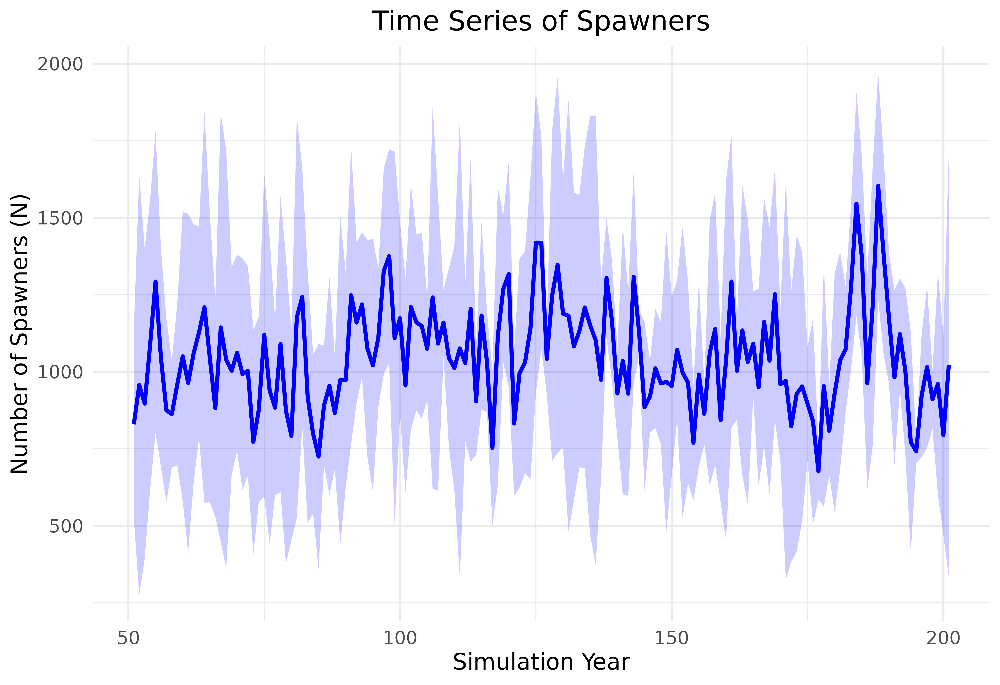

# 6. Population Model Evaluation

### Overview

We can compare the sensitivity of parameters within the population
model. This is useful to understand parameters that are more or less
sensitive to perturbations. In this example we will swap out different
life cycle profiles for populations of Chinook Salmon and see how the
sensitivity of input parameters changes our results. We will use
stressor-response and stressor-magnitude values from for Nanaimo River
Chinook salmon, but we will swap out the life cycle profile data for the
following populations:

- Nanaimo River Summer Chinook (vital rates from DFO-RAMs).
- Chehalis River Spring/Fall Chinook in coastal Washington (using
  parameters published from Beechie et al., 2021).
- Columbia River Chinook from Wenatchee River (using parameters from
  Honea et al., 2009: Freshwater Biology).
- Nicola River spring-run Chinook from the interior of BC (DFO-RAMs
  2021).

### Load Input Data

In this example we will load the stressor-response, stressor magnitude
file and life cycles file. The polygon geometry is not needed to run the
population model. Reset `filename_` to point to a local file on your
computer. We will load the Nanaimo River Chinook salmon data as a
starting point.

``` r
  library(CEMPRA)

  # Stressor Magnitude
  fname <- system.file("extdata/nanaimo/stressor_magnitude_nanaimo.xlsx", package = "CEMPRA")
  dose <- StressorMagnitudeWorkbook(filename = fname)
  dose$SD <- 0

  # Stressor Response
  fname <- system.file("extdata/nanaimo/stressor_response_nanaimo.xlsx", package = "CEMPRA")
  sr_wb_dat <- StressorResponseWorkbook(filename = fname)

  # Load location and habitat capacities
  filename <- system.file("extdata/nanaimo/habitat_capacities_nanaimo.csv", package = "CEMPRA")
  habitat_capcities <- read.csv(filename, stringsAsFactors = FALSE)
    
  # Load the life cycle parameters
  filename_lc <- system.file("extdata/nanaimo/species_profiles/nanaimo_comp_ocean_summer.csv", package = "CEMPRA")
  life_cycle_params <- read.csv(filename_lc)
    
    
```

### Target Populations

The following habitat capacities files lists the target populations. The
density-dependent constraints esimtate capacities in the absence of any
stressors and assume that 100% of the stream area is suitable for
spawning (e.g., gravel coverage = 100% and spawning suitability = 100%).
We have specific stressors targetting capacities that will shink these
numbers down to more realistic estimates.

1.  Lower Nanaimo River Fall-Run Chinook
2.  Lower Nanaimo River Summer-Run Chinook
3.  Upper Nanaimo River Spring/Summer-Run Chinook

``` r
print(habitat_capcities)
#>   HUC_ID           NAME k_stage_0_mean k_stage_Pb_1_mean k_stage_B_mean
#> 1      1     Fall Lower         627594                NA          38073
#> 2      2 Summer - Lower        1247555                NA          15384
#> 3      3 Summer - Upper         913589                NA          20943

# Focus analysis on the Lower Nanaimo River Summer-Run Chinook (1)
HUC_ID <- 2
```

### Run the Population Model

Next, we can run the population model for a number of years `n_years`
and batch replicates `MC_sims`.

``` r
    
    data <- PopulationModel_Run(
        dose = dose,
        sr_wb_dat = sr_wb_dat,
        life_cycle_params = life_cycle_params,
        HUC_ID = 2, # Lower Summer-run Chinook
        n_years = 200, # run for 200 years
        MC_sims = 5, # batch replicates
        habitat_dd_k = habitat_capcities # Population-specific carrying capacities
    )

    # Model returns object with all data nested in a list object
    names(data)
#> [1] "ce"       "baseline" "MC_sims"
    # ce = with cumulative effect stressors
    
    # 5 batch replicates
    length(data$ce)
#> [1] 5
    
    # Look at replicate 2 of 5
    names(data$ce[[2]])
#> [1] "pop"     "N"       "lambdas" "info"
    
    # We want to review the N object that contains the population abundance in each stage class
    tail(round(data$ce[[2]]$N, 0))
#>           K1   K2   K3  K4  K5  K6  K7
#> [196,] 19698 2660  382 732  84 984  95
#> [197,] 71512  335 1480 134 339 185 603
#> [198,] 50142 3531  170 452  37 618 108
#> [199,] 54265 3497 2082  55 454  73 352
#> [200,] 58136 2445 1681 676 378 917  44
#> [201,] 67526 1613 1368 595 308 806 530
```

### Visualize the Time Series Projections

Simple plots can be included to visualize trends

``` r

spawners <- pop_model_get_spawners(data = data,
                                   life_stage = "spawners",
                                   life_cycle_params = life_cycle_params)

head(spawners)
#>   location_id rep_id year spawners
#> 1           2      1    1    15384
#> 2           2      1    2     1649
#> 3           2      1    3     2277
#> 4           2      1    4     1759
#> 5           2      1    5     1663
#> 6           2      1    6     1134

library(dplyr)
#> 
#> Attaching package: 'dplyr'
#> The following objects are masked from 'package:stats':
#> 
#>     filter, lag
#> The following objects are masked from 'package:base':
#> 
#>     intersect, setdiff, setequal, union
summary_data <- spawners %>%
  filter(year > 50) %>%
  group_by(location_id, year) %>%
  summarize(
    mean_spawners = mean(spawners),
    sd_spawners = sd(spawners),
    .groups = 'drop'
  )
head(summary_data)
#> # A tibble: 6 × 4
#>   location_id  year mean_spawners sd_spawners
#>         <dbl> <int>         <dbl>       <dbl>
#> 1           2    51          830.        305.
#> 2           2    52          957         682.
#> 3           2    53          897.        502.
#> 4           2    54         1088         471.
#> 5           2    55         1293.        489.
#> 6           2    56         1044.        353.

library(ggplot2)
# Create the ggplot
ggplot(summary_data, aes(x = year, y = mean_spawners, group = location_id)) +
  geom_line(color = "blue", size = 1) +  # Line for mean spawners
  geom_ribbon(
    aes(ymin = mean_spawners - sd_spawners, ymax = mean_spawners + sd_spawners),
    fill = "blue",
    alpha = 0.2
  ) +  # Shading for ±1 standard deviation
  labs(title = "Time Series of Spawners", x = "Simulation Year", y = "Number of Spawners (N)") +
  theme_minimal() +
  theme(plot.title = element_text(hjust = 0.5), text = element_text(size = 12))
#> Warning: Using `size` aesthetic for lines was deprecated in ggplot2 3.4.0.
#> ℹ Please use `linewidth` instead.
#> This warning is displayed once every 8 hours.
#> Call `lifecycle::last_lifecycle_warnings()` to see where this warning was
#> generated.
```



## Location and life stage-specific BH capacities

Run an Example with BH carrying capacities
